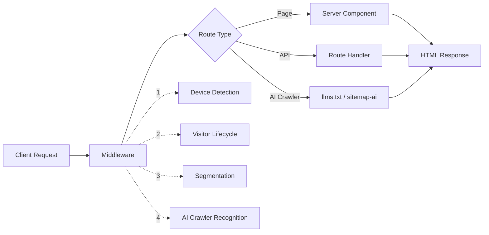

<div align="center">

# MS Schlüsseldienst Wetzlar

**Production-grade website for a regional locksmith service, built with Next.js 15 and optimized for local SEO dominance across 114 service areas in central Hesse, Germany.**

<br />


</div>

---

## Contents

- [About the Project](#about-the-project)
- [Features](#features)
- [Tech Stack](#tech-stack)
- [Design System](#design-system)
- [Getting Started](#getting-started)
- [Project Structure](#project-structure)
- [Route Map](#route-map)
- [Architecture](#architecture)
- [SEO and AI Discovery](#seo-and-ai-discovery)
- [Security](#security)
- [Performance](#performance)
- [Documentation](#documentation)
- [Deployment](#deployment)
- [License](#license)

---

## About the Project

This is the production website for MS Schlüsseldienst Wetzlar, a 24/7 emergency locksmith service operating across central Hesse. The project is not a template or a WordPress build. It is a custom-engineered Next.js application that treats every route as a conversion endpoint and every byte of JavaScript as a cost.

The site generates 114 unique, SEO-optimized landing pages for individual service areas (Wetzlar, Giessen, Marburg, Solms, Asslar, all Biebertal and Hohenahr districts, and 100+ more), each with localized content, travel times, and structured data. It exposes machine-readable endpoints for 10 AI search systems (ChatGPT, Perplexity, Google SGE, Siri, Alexa, and others), includes enterprise-grade security headers, and implements visitor segmentation via edge middleware without any third-party analytics dependency.

The design system is defined entirely in code: 1,724 lines of CSS custom properties powering a fluid typography scale, semantic color surfaces, elevation tokens, and component variants. Every visual decision is traceable to a design token.

The result is a sub-2-second loading website that ranks independently for every city it serves, communicates directly with AI crawlers, is fully compliant with German law (DDG, DSGVO, BGB, BFSG 2025), and converts mobile visitors into phone calls through a single tap.

---

## Features

**Local SEO at Scale**
- 114 auto-generated city landing pages with unique content per location
- 7 JSON-LD schema types (Locksmith, FAQ, BreadcrumbList, HowTo, Service, WebSite, AggregateRating)
- Dynamic sitemap from `CONTENT_GRAPH` and `allLocations` with weighted priorities
- Canonical URLs, hreflang tags, and geo-meta tags on every route
- OG image generation via dedicated API route

**AI Discovery Layer**
- `/llms.txt` endpoint with structured business summary for LLMs
- `/llms-full.txt` endpoint with complete content dump
- `/sitemap-ai.xml` with AI-prioritized URL weighting
- 10 AI crawlers explicitly permitted in `robots.ts` (GPTBot, ClaudeBot, PerplexityBot, Google-Extended, Applebot-Extended, Amazonbot, and more)
- Middleware detection with `X-AI-Crawler: welcome` response header

**Conversion Architecture**
- Above-the-fold phone CTA on all viewports without scrolling
- Persistent `MobileBottomBar` with tap-to-call on every page
- 4-segment visitor personalization via edge middleware (new-visitor, returning, high-intent, service-interested)
- Exit-intent detection via `useExitIntent` hook
- Return visitor recognition with personalized content
- Price estimator and trust signals visible on first viewport

**Security**
- Content Security Policy with 11 directives, enforced via both middleware and `next.config.ts`
- HSTS with 2-year max-age, includeSubDomains, and preload
- 4-layer form protection: Honeypot, CSRF validation, rate limiting (5/min API, 5/hour Server Action), Zod schema validation
- 6 input sanitization functions in `lib/sanitize.ts` (escapeHTML, sanitizeInput, stripHTML, sanitizeSearchParam, sanitizeEmail, sanitizeHTML)
- CSP violation reporting via `/api/csp-report`
- Permissions-Policy blocking camera, microphone, geolocation, payment, USB, bluetooth

**Accessibility**
- Skip navigation link (`SkipNav` component)
- ARIA live region route announcer (`RouteAnnouncer`)
- Focus trapping via `useFocusManagement` hook
- `prefers-reduced-motion` respected via `useReducedMotion` and `useAdaptiveAnimation`
- Semantic HTML with `lang="de"`, single `<h1>` per page, breadcrumb navigation
- 3-channel feedback in interactive elements (icon, text, color)

**Performance**
- Server Components as default, `"use client"` only where browser APIs are required
- 11 components lazy-loaded via `next/dynamic`
- Framer Motion tree-shaken with `LazyMotion` and `domAnimation`
- `next/image` with AVIF/WebP, 1-year cache TTL
- `next/font` with `display: "swap"` for three font families
- Console removal in production builds
- Immutable caching for static assets (1 year)

**Resilience**
- Route-level error boundary (`app/error.tsx`) with phone number fallback
- Root error boundary (`app/global-error.tsx`) with maintenance page
- Custom 404 page with navigation and emergency phone number
- Global error handlers for `window.onerror` and `unhandledrejection`
- Health check endpoint at `/api/health`
- Error aggregation and anomaly detection via `/api/monitoring/errors`
- Network status detection via `useNetworkStatus` hook

**Legal Compliance (DSGVO, DDG, BGB, BFSG 2025)**
- Cookie consent system with granular category control (`useConsent` hook)
- Cookie inventory as single source of truth (`lib/cookie-inventory.ts`)
- Analytics blocked by default until explicit opt-in
- Complete legal pages: Impressum (§ 5 DDG), Datenschutz, AGB, Cookie-Richtlinie, Widerruf (§§ 312ff BGB), Barrierefreiheit (BFSG 2025)
- `security.txt` (RFC 9116) at `/.well-known/security.txt`
- 404-Forensik: Server-side logging of all 404 hits with referer for broken backlink detection

**Scroll & Navigation**
- `ScrollToTop` component resets scroll position on every client-side route change
- Scroll containment via CSS (`html overflow: hidden`, `body overflow-y: auto`) prevents stale scroll height after navigation
- Smooth scroll with `scroll-behavior: smooth` on the body scroll container

---

## Tech Stack

| Technology | Version | Purpose |
|:---|:---:|:---|
| Next.js | 15.5.14 | App Router, Server Components, SSG, ISR, Middleware |
| React | 19.2.1 | UI components, hooks |
| TypeScript | 5.9.3 | Type safety, `strict: true`, `noImplicitReturns: true` |
| Tailwind CSS | 4.1.11 | Utility-first styling, design tokens |
| Framer Motion | 11.18.2 | Animations, page transitions, LazyMotion |
| Lucide React | 0.553.0 | Icon system |
| React Hook Form | via @hookform/resolvers 5.2.1 | Form state, Zod validation |
| class-variance-authority | 0.7.1 | Component variant management |
| tailwind-merge | 3.3.1 | Class conflict resolution |
| Formspree | external | Contact form backend |
| Google Maps JS API | via @googlemaps/js-api-loader 2.0.2 | Service area map |

**Development Tooling**

| Tool | Version | Purpose |
|:---|:---:|:---|
| Vitest | 4.1.0 | Unit and integration tests |
| Playwright | 1.58.2 | End-to-end tests |
| Testing Library | React 16.3.2, DOM 10.4.1 | Component testing utilities |
| ESLint | 9.39.1 | Linting with Next.js config |
| @next/bundle-analyzer | 16.1.6 | Bundle size analysis |
| Turbopack | built-in | Development server (`next dev --turbopack`) |

> This project has no dependency on any Headless CMS, external AI API, external error tracking (Sentry), newsletter system, internationalization framework, or dark mode implementation.

---

## Design System

The visual identity is defined entirely through CSS custom properties in `globals.css` (1,724 lines). There are no external design tools, no Figma tokens plugin, no runtime theme providers. Every visual decision is encoded as a token and consumed by Tailwind CSS 4 via `@theme`.

### Typography — Fluid Major Third Scale

All type sizes use `clamp()` for fluid responsiveness without media queries:

| Token | Range | Line Height | Use Case |
|:---|:---|:---:|:---|
| `--text-display` | `clamp(2rem, 5vw + 0.75rem, 4rem)` | 1.1 | Hero headlines |
| `--text-h1` | `clamp(1.5rem, 3vw + 0.75rem, 3rem)` | 1.15 | Page titles |
| `--text-h2` | `clamp(1.25rem, 2.5vw + 0.625rem, 2.25rem)` | 1.2 | Section headings |
| `--text-h3` | `clamp(1.125rem, 2vw + 0.5rem, 1.75rem)` | 1.25 | Card titles |
| `--text-body` | `1rem` | 1.6 | Body copy |
| `--text-lead` | `1.125rem` | 1.7 | Introductory paragraphs |
| `--text-small` | `0.875rem` | 1.5 | Captions, labels |
| `--text-tiny` | `0.75rem` | 1.4 | Legal text, timestamps |

Three font families loaded via `next/font` with `display: "swap"`:

| Variable | Font | Role |
|:---|:---|:---|
| `--font-display` | Plus Jakarta Sans | Headlines, CTAs |
| `--font-body` | DM Sans | Body text, navigation |
| `--font-mono` | JetBrains Mono | Code, technical labels |

### Color Architecture — Semantic Surfaces

Colors are organized in three layers: raw palette, semantic surfaces, and Tailwind aliases.

```
Raw Palette          →   Semantic Layer          →   Tailwind Alias
--color-blush-600         --action-primary             --color-brand-primary
--color-slate-900         --surface-primary            --color-surface-default
--color-slate-600         --text-secondary             --color-text-secondary
--color-red-500           --color-status-error         --color-status-error
```

| Surface Token | Purpose |
|:---|:---|
| `--surface-primary` | Page backgrounds |
| `--surface-secondary` | Card and section backgrounds |
| `--surface-elevated` | Modals, dropdowns, popovers |
| `--surface-dark` | Dark sections, footer |

### Elevation & Shadows

5-level elevation system with brand-tinted shadows:

| Token | Level | Use Case |
|:---|:---:|:---|
| `--shadow-0` | None | Flat elements |
| `--shadow-1` | Subtle | Cards at rest |
| `--shadow-2` | Medium | Hovered cards |
| `--shadow-3` | Strong | Dropdowns, modals |
| `--shadow-4` | Maximum | Floating action buttons |
| `--shadow-brand-*` | 1–4 | Brand-tinted variants of each level |

### Spacing — 8px Grid with Fluid Sections

Micro-spacing follows an 8px base grid (`--space-0` through `--space-13`). Macro-spacing for page sections uses fluid `clamp()` values:

| Token | Value |
|:---|:---|
| `--spacing-section-sm` | `clamp(3rem, 2rem + 4vw, 5rem)` |
| `--spacing-section-base` | `clamp(4rem, 3rem + 5vw, 6rem)` |
| `--spacing-section-lg` | `clamp(5rem, 4rem + 6vw, 8rem)` |

### Component Variants (CVA)

Interactive components use `class-variance-authority` for type-safe variant management:

```tsx
// Example: buttonVariants from components/ui/button.tsx
const buttonVariants = cva("inline-flex items-center justify-center ...", {
  variants: {
    variant: { primary: "...", secondary: "...", ghost: "..." },
    size: { sm: "...", default: "...", lg: "..." },
  },
  defaultVariants: { variant: "primary", size: "default" },
});
```

All variant classes are resolved at build time through `tailwind-merge`, eliminating runtime class conflicts.

### Animation System

Framer Motion is loaded via `LazyMotion` with `strict` mode to enforce tree-shaking:

- All animated components use `m` (lazy) instead of `motion` (full bundle)
- `MotionProvider` wraps the entire app with `domAnimation` features
- `useReducedMotion` and `useAdaptiveAnimation` hooks respect user preferences
- `prefers-reduced-motion: reduce` disables all non-essential animations

## Getting Started

### Prerequisites

- Node.js 18 or later
- npm 10 or later

### Installation

```bash
# 1. Clone the repository
git clone https://github.com/umutcantezgel-cpu/MS-Schl-sseldienst.git
cd MS-Schl-sseldienst

# 2. Install dependencies
npm install

# 3. Configure environment variables
cp .env.example .env.local
```

Edit `.env.local` with your values:

| Variable | Description | Required |
|:---|:---|:---:|
| `NEXT_PUBLIC_GOOGLE_MAPS_API_KEY` | Google Maps JavaScript API key for the service area map | Yes |
| `NEXT_PUBLIC_APP_VERSION` | Application version string | No |
| `NEXT_PUBLIC_BASE_URL` | Base URL for canonical URLs and smoke tests (`http://localhost:3000` for dev) | No |

```bash
# 4. Start the development server
npm run dev
```

The application will be available at [http://localhost:3000](http://localhost:3000).

### Available Scripts

| Command | Description |
|:---|:---|
| `npm run dev` | Start development server with Turbopack |
| `npm run build` | Create production build |
| `npm run start` | Start production server locally |
| `npm run lint` | Run ESLint |
| `npm run typecheck` | Run TypeScript strict check (`tsc --noEmit`) |
| `npm run validate` | Run lint, typecheck, and build sequentially |
| `npm run test` | Run Vitest unit tests |
| `npm run test:watch` | Run Vitest in watch mode |
| `npm run test:e2e` | Run Playwright end-to-end tests |
| `npm run test:all` | Run unit tests and e2e tests |
| `npm run test:smoke` | Run smoke tests against 7 endpoints |
| `npm run build:analyze` | Production build with bundle analysis |
| `npm run clean` | Clear `.next` build cache |

---

## Project Structure

```
app/
├── (legal)/                    Route group: legal pages
│   ├── impressum/              Impressum (legal notice)
│   ├── datenschutz/            Privacy policy (DSGVO)
│   ├── agb/                    Terms and conditions
│   ├── cookie-richtlinie/      Cookie policy
│   ├── widerruf/               Cancellation policy
│   └── barrierefreiheit/       Accessibility statement
├── (marketing)/                Route group: all public content
│   ├── [stadtgebiet]/          Dynamic: 78 city landing pages
│   ├── leistungen/             Services overview + 5 detail pages
│   ├── preise/                 Pricing with interactive estimator
│   ├── kontakt/                Contact form (Formspree)
│   ├── faq/                    FAQ with schema markup
│   ├── bewertungen/            Customer reviews
│   ├── servicegebiet/          Service area with map
│   ├── ueber-uns/              About, team, history, philosophy, careers
│   ├── blog/                   Blog with categories
│   ├── case-studies/           Case studies with detail pages
│   └── ... (12 more routes)
├── api/
│   ├── contact/                Form submission handler
│   ├── csp-report/             CSP violation logging
│   ├── health/                 Health check endpoint
│   ├── monitoring/errors/      Error aggregation
│   └── og/                     Dynamic OG image generation
├── llms.txt/                   AI crawler: business summary
├── llms-full.txt/              AI crawler: full content dump
├── sitemap-ai.xml/             AI crawler: prioritized sitemap
├── sitemap.ts                  Standard sitemap (auto-generated)
├── robots.ts                   Robots with AI crawler rules
├── page.tsx                    Homepage (27 kB, SSG)
├── layout.tsx                  Root layout with fonts, metadata, providers
├── error.tsx                   Error boundary with phone fallback
├── global-error.tsx            Root error boundary
├── not-found.tsx               Custom 404
├── loading.tsx                 Loading skeleton
└── template.tsx                Page transition wrapper

components/
├── HeroSection.tsx             Above-the-fold conversion block
├── StickyHeader.tsx            Responsive header with mobile nav
├── Footer.tsx                  Footer with sitemap links
├── MobileBottomBar.tsx         Persistent mobile CTA bar
├── EmergencyCTA.tsx            Emergency call-to-action
├── HeroCTA.tsx                 Hero call-to-action with phone
├── Breadcrumbs.tsx             Breadcrumb nav with JSON-LD
├── about/                      About section components
├── analytics/                  WebVitalsReporter, ScrollDepthTracker
├── animations/                 Animation wrappers
├── contact/                    Contact form, map embed
├── forms/                      Form components with validation
├── growth/                     PersonalizedHero, PriceEstimator, ReturnVisitorBanner
├── layout/                     Layout primitives
├── locations/                  LocalHero, LocalContentBlocks, NeighborGrid
├── mobile/                     Mobile-specific components
├── monitoring/                 ErrorHandlers (global capture)
├── motion/                     Motion providers, LazyMotion
├── pricing/                    Pricing cards, comparison tables
├── providers/                  MotionProvider, context providers
├── reviews/                    Review carousel, GoogleReviewsBadge
├── sections/                   FinalCTA, TrustStrip, ServiceCards
├── trust/                      Trust signals, badges
└── ui/                         Button, Card, Badge, CookieConsent, JsonLd, SkipNav, RouteAnnouncer

hooks/                          13 custom React hooks
├── useConsent.ts               Cookie consent management
├── useVisitorSegment.ts        Visitor segment detection
├── useExitIntent.ts            Exit intent detection
├── useFocusManagement.ts       Focus trapping for modals
├── useReducedMotion.ts         prefers-reduced-motion
├── useAdaptiveAnimation.ts     Device-aware animation config
├── useNetworkStatus.ts         Network quality detection
├── useScrollDepth.ts           Scroll depth tracking
└── ...

lib/
├── data/                       Local data (allLocations, services, blog, jobs, awards, ...)
├── design-tokens/              Design system tokens
├── monitoring/                 Error logger, anomaly detection
├── types/                      Global TypeScript interfaces
├── schema.ts                   Locksmith JSON-LD (9.9 kB)
├── faqSchema.ts                FAQ schema generator
├── serviceSchema.ts            Service schema generator
├── metadata.ts                 Shared metadata generator
├── contentGraph.ts             Internal linking graph
├── sanitize.ts                 6 input sanitization functions
├── personalization.ts          4-segment visitor logic
├── localData.ts                78 locations dataset (22 kB)
├── faqData.ts                  FAQ dataset (13 kB)
├── cookie-inventory.ts         Cookie registry (7.6 kB)
└── ...

docs/                           10 documentation files
├── ARCHITECTURE.md             Component hierarchy, data flow, rendering
├── SECURITY-CHECKLIST.md       CSP, DSGVO, input validation
├── MONITORING-GUIDE.md         Error logging, Web Vitals, health checks
├── INCIDENT-RESPONSE.md        P1-P4 severity, rollback, post-mortem
├── deployment-guide.md         Vercel, environment, CI/CD
├── MAINTENANCE.md              Maintenance schedule
├── HANDOFF.md                  Developer onboarding
├── content-guidelines.md       Content writing standards
├── branching-strategy.md       Git workflow
└── external-services.md        Third-party service documentation
```

---

## Route Map

### Public Routes (Marketing)

| Route | Page | Type | Description |
|:---|:---|:---:|:---|
| `/` | Homepage | SSG | Hero, services, pricing, reviews, CTA |
| `/leistungen` | Services | SSG | All services as card grid |
| `/leistungen/turoeffnung` | Door Opening | SSG | Core service detail page |
| `/leistungen/autooeffnung` | Car Opening | SSG | Automotive lockout service |
| `/leistungen/schliessanlagen` | Lock Systems | SSG | Lock installation and replacement |
| `/leistungen/sicherheitstechnik` | Security Tech | SSG | Security technology services |
| `/leistungen/schluessel-nachmachen` | Key Cutting | SSG | Key duplication service |
| `/leistungen/[slug]` | Service Detail | Dynamic | Additional service pages |
| `/preise` | Pricing | SSG | Price tables with estimator |
| `/kontakt` | Contact | SSG | Form (Formspree), map, details |
| `/faq` | FAQ | SSG | FAQ page with JSON-LD schema |
| `/bewertungen` | Reviews | SSG | Customer reviews |
| `/servicegebiet` | Service Area | SSG | Map with 114 service areas |
| `/ueber-uns` | About | SSG | Company overview |
| `/ueber-uns/team` | Team | SSG | Team members |
| `/ueber-uns/geschichte` | History | SSG | Company history |
| `/ueber-uns/philosophie` | Philosophy | SSG | Company values |
| `/ueber-uns/karriere` | Careers | SSG | Job listings |
| `/blog` | Blog | SSG | Blog index |
| `/blog/[slug]` | Blog Post | Dynamic | Individual blog posts |
| `/blog/kategorie/[category]` | Blog Category | Dynamic | Filtered blog view |
| `/case-studies` | Case Studies | SSG | Project showcases |
| `/case-studies/[slug]` | Case Study | Dynamic | Individual case study |
| `/[stadtgebiet]` | City Page | SSG | 114 localized landing pages |
| `/termin-buchen` | Booking | SSG | Appointment scheduling |
| `/referenzen` | References | SSG | Partner references |
| `/partner` | Partners | SSG | Partner directory |
| `/aktion` | Promotions | SSG | Current promotions |
| `/glossar` | Glossary | SSG | Locksmith terminology |
| `/checklisten` | Checklists | SSG | Security checklists |
| `/ressourcen` | Resources | SSG | Resource center |
| `/anfrage` | Request | SSG | Service request form |
| `/danke` | Thank You | SSG | Form confirmation |
| `/auszeichnungen` | Awards | SSG | Awards and certifications |
| `/angebot/[slug]` | Quote | Dynamic | Custom quote pages |

### Legal Routes

| Route | Type |
|:---|:---:|
| `/impressum` | SSG |
| `/datenschutz` | SSG |
| `/agb` | SSG |
| `/cookie-richtlinie` | SSG |
| `/widerruf` | SSG |
| `/barrierefreiheit` | SSG |

### API Routes

| Endpoint | Method | Purpose |
|:---|:---:|:---|
| `/api/contact` | POST | Form submission to Formspree |
| `/api/csp-report` | POST | CSP violation logging |
| `/api/health` | GET | Health check (uptime, memory, version) |
| `/api/monitoring/errors` | POST | Error aggregation with deduplication and rate limiting |
| `/api/og` | GET | Dynamic Open Graph image generation |

### AI Discovery Routes

| Endpoint | Purpose |
|:---|:---|
| `/llms.txt` | Structured business summary for LLM crawlers |
| `/llms-full.txt` | Complete content dump for deep AI indexing |
| `/sitemap-ai.xml` | AI-prioritized URL map with weighted importance |

---

## Architecture



### Rendering Strategy

The project uses three rendering modes, selected per route based on content volatility:

| Mode | Routes | Rationale |
|:---|:---|:---|
| **SSG** (Static Site Generation) | Homepage, services, pricing, legal, blog index | Content changes infrequently. Pre-rendered at build time for maximum performance. |
| **ISR** (Incremental Static Regeneration) | City pages (`/[stadtgebiet]`) | 114 pages generated via `generateStaticParams`. Content is locality-specific but stable. |
| **Dynamic** | API routes, `llms.txt`, `sitemap-ai.xml`, blog/case-study detail | Server-rendered on demand. API routes require request context. |

### Data Architecture

All content lives as typed TypeScript objects in `lib/data/`. There is no CMS, no database, no external API dependency for content.

| Domain | Source File | Records | Consumers |
|:---|:---|:---:|:---|
| Locations | `lib/localData.ts` | 114 | City pages, service area, sitemap |
| FAQs | `lib/faqData.ts` (13 kB) | 30+ | FAQ page, city pages, schema |
| Services | `lib/data/services.ts` | 5 | Service pages, homepage, schema |
| Blog Posts | `lib/data/blog.ts` | variable | Blog index, detail pages |
| Case Studies | `lib/data/caseStudies.ts` | variable | Case studies index, detail pages |
| Reviews | `components/reviews/reviews.data.ts` | variable | Reviews page, homepage |
| Jobs | `lib/data/jobs.ts` | variable | Careers page |
| Awards | `lib/data/awards.ts` | variable | Awards page |
| Pricing | `components/pricing/pricing.constants.ts` | 5 tiers | Pricing page, homepage |

Server Components import data directly. No fetch calls, no loading states, no waterfall. Data is available at build time and baked into the static HTML.

### Middleware Pipeline

`middleware.ts` runs on every non-static request and performs four tasks in sequence:

1. **Device Detection** — Sets `x-device-type` header (mobile, tablet, desktop)
2. **Visitor Lifecycle** — Tracks new/returning visitors via cookie, upgrades on second visit
3. **Visitor Segmentation** — Classifies visitors into 4 segments based on URL and visit history: `new-visitor`, `returning`, `high-intent` (visiting /kontakt or /preise), `service-interested` (visiting /leistungen/*)
4. **AI Crawler Recognition** — Detects 10 AI crawlers and sets `X-AI-Crawler: welcome` header

### Internal Linking

`lib/contentGraph.ts` defines a graph of all content nodes with `relatedSlugs`. Each page knows its neighbors. This drives cross-linking in footers, breadcrumbs, and "related services" sections. Google follows these links to understand the topical hierarchy.

---

## SEO and AI Discovery

### Metadata Generation

Every route calls `generateSharedMetadata()` from `lib/metadata.ts`, which produces:

- Unique `<title>` and `<meta description>` per page
- Canonical URL with enforced trailing slash
- `hreflang` tags (`de-DE` and `x-default`)
- Geo-meta tags (region, placename, position)
- Open Graph tags with title, description, type, locale
- `googleBot` directives: `max-snippet:-1`, `max-image-preview:large`, `max-video-preview:-1`

### Structured Data (JSON-LD)

7 schema types are implemented across the site:

| Schema | Location | Purpose |
|:---|:---|:---|
| `Locksmith` (LocalBusiness) | Root layout | Business identity, address, phone, hours, pricing, rating, service area (GeoCircle + 114 cities) |
| `WebSite` + `SearchAction` | Root layout | Sitelinks search box in Google SERP |
| `BreadcrumbList` | Every subpage | Breadcrumb trail in search results |
| `FAQPage` | FAQ, pricing, city pages | FAQ rich results with expandable answers |
| `Service` + `PriceSpecification` | Pricing page | Service listings with price ranges |
| `AggregateRating` + `Review` | Reviews section | Star rating in SERP |
| `HowTo` | City pages | Step-by-step instructions |

### AI Crawler Access

The `robots.ts` configuration explicitly grants full access to 10 AI crawlers and references both the standard sitemap and the AI-specific sitemap. The middleware adds a `X-AI-Crawler: welcome` header when it detects an AI user agent. The `/llms.txt`, `/llms-full.txt`, and `/sitemap-ai.xml` endpoints provide machine-optimized content that does not require HTML parsing.

---

## Security

All security headers are applied twice for defense in depth: once in the Next.js middleware (per-request) and once in `next.config.ts` (build-time).

<details>
<summary><strong>Security Headers</strong></summary>

| Header | Value | Purpose |
|:---|:---|:---|
| `Strict-Transport-Security` | `max-age=63072000; includeSubDomains; preload` | Force HTTPS for 2 years |
| `Content-Security-Policy` | 11 directives | Restrict script/style/connect sources |
| `X-Frame-Options` | `DENY` | Prevent clickjacking |
| `X-Content-Type-Options` | `nosniff` | Prevent MIME-type sniffing |
| `Referrer-Policy` | `strict-origin-when-cross-origin` | Control referrer leakage |
| `Permissions-Policy` | Camera, microphone, geolocation, payment, USB, bluetooth blocked | Restrict browser APIs |
| `X-DNS-Prefetch-Control` | `on` | Enable DNS prefetching |

</details>

<details>
<summary><strong>Form Protection (4 Layers)</strong></summary>

1. **Honeypot field** — Invisible `website` field; if filled, submission is silently rejected
2. **CSRF validation** — Origin header check against allowed domains
3. **Rate limiting** — 5 requests/minute (API route), 5 requests/hour (Server Action)
4. **Zod schema validation** — Strict type checking with min/max length constraints on all fields

</details>

<details>
<summary><strong>Input Sanitization</strong></summary>

`lib/sanitize.ts` exports 6 functions:

- `escapeHTML()` — Escapes `<`, `>`, `&`, `"`, `'`
- `sanitizeInput()` — Strips control characters and dangerous patterns
- `stripHTML()` — Removes all HTML tags
- `sanitizeSearchParam()` — Validates and cleans URL parameters
- `sanitizeEmail()` — Validates email format and strips injection patterns
- `sanitizeHTML()` — Strips `<script>`, `<iframe>`, `<object>`, `<embed>`, `<form>`, `<style>`, event handlers, and `javascript:` URIs

</details>

---

## Performance

| Metric | Value |
|:---|:---:|
| Static pages | 44 |
| API routes | 7 |
| Dynamic routes | 5 |
| City landing pages | 114 |
| Design tokens (CSS) | 1,724 LOC |
| Image formats | AVIF, WebP |
| Image cache TTL | 1 year (31,536,000s) |
| Static asset caching | `immutable, max-age=31536000` |
| Page caching | `s-maxage=86400, stale-while-revalidate=43200` |
| Font loading | `display: "swap"`, 3 font families via `next/font` |
| Console output | Removed in production (except `error`, `warn`) |
| Deployment region | Frankfurt (`fra1`) |

---

## Documentation

| Document | Content |
|:---|:---|
| [ARCHITECTURE.md](docs/ARCHITECTURE.md) | Component hierarchy, data flow, rendering strategy |
| [SECURITY-CHECKLIST.md](docs/SECURITY-CHECKLIST.md) | CSP, DSGVO, input validation procedures |
| [MONITORING-GUIDE.md](docs/MONITORING-GUIDE.md) | Error logging, Web Vitals, health checks |
| [INCIDENT-RESPONSE.md](docs/INCIDENT-RESPONSE.md) | P1-P4 severity classification, rollback, post-mortem |
| [deployment-guide.md](docs/deployment-guide.md) | Vercel configuration, environment, CI/CD |
| [MAINTENANCE.md](docs/MAINTENANCE.md) | Weekly, monthly, quarterly, annual maintenance tasks |
| [HANDOFF.md](docs/HANDOFF.md) | Developer onboarding guide |
| [content-guidelines.md](docs/content-guidelines.md) | Content writing standards |
| [branching-strategy.md](docs/branching-strategy.md) | Git workflow and branch naming |
| [external-services.md](docs/external-services.md) | Third-party service documentation |

---

## Deployment

The project is configured for Vercel with the Frankfurt (fra1) region.

```bash
# 1. Verify the build passes locally
npm run validate

# 2. Push to main branch
git push origin main
```

Vercel deploys automatically on push to `main`. Preview deployments are created for pull requests.

**Required environment variables on Vercel:**

| Variable | Description |
|:---|:---|
| `NEXT_PUBLIC_GOOGLE_MAPS_API_KEY` | Google Maps JavaScript API key |
| `NEXT_PUBLIC_BASE_URL` | Production URL (e.g., `https://www.schluesseldienst-wetzlar.de`) |

See [deployment-guide.md](docs/deployment-guide.md) for rollback procedures and CI/CD pipeline details.

---

## License

This project is proprietary software. All rights reserved.

---

<p align="right"><a href="#ms-schlüsseldienst-wetzlar">Back to top</a></p>
